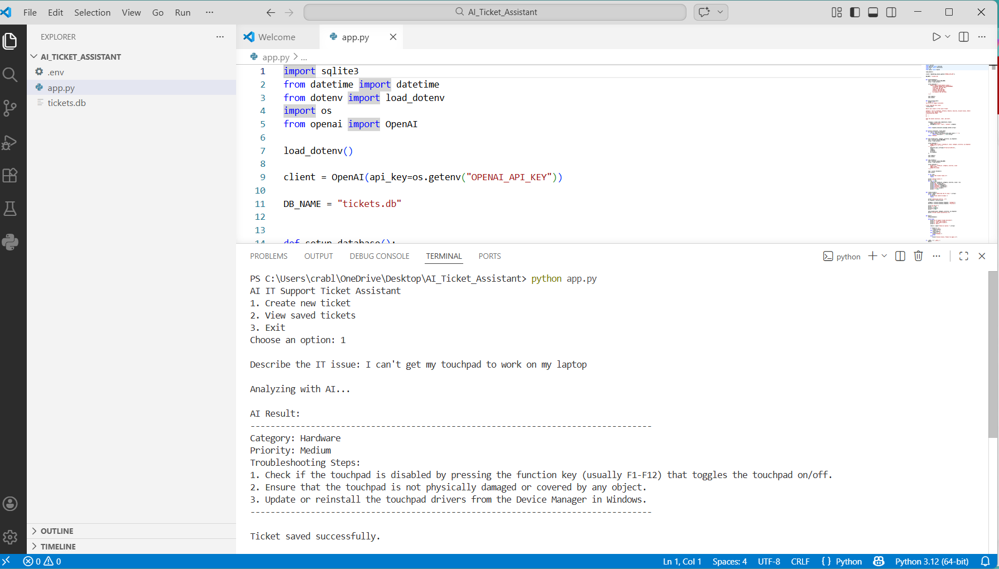

# AI IT Support Ticket Assistant

A Python-based application that simulates a real-world IT help desk system using AI.

## Features
- Accepts IT support issues from users
- Uses AI to classify issue category and priority
- Generates troubleshooting steps
- Stores tickets in a SQLite database
- Allows review of past tickets

## Technologies Used
- Python
- OpenAI API
- SQLite

## Example

Input:
"My laptop connects to Wi-Fi but cannot open websites"

Output:
Category: Network  
Priority: High  
Troubleshooting Steps:
1. Check IP configuration and DNS settings  
2. Restart router and network adapter  
3. Disable firewall or VPN if needed  

## How to Run

pip install openai python-dotenv
python app.py

## Screenshot

## Author
Jamie Crable
IT Support & Software Development Student
LinkedIn: https://www.linkedin.com/in/jamie-crable-082ba1254
